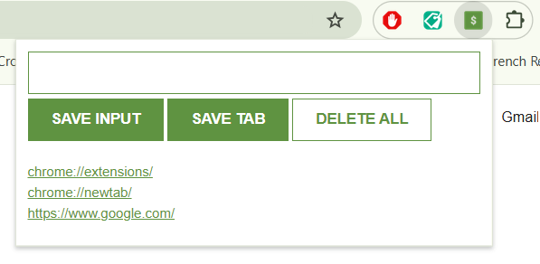

# Chrome-extension

This app is a chrome extension made for saving leads, websites etc.
 
 
When entering manually a lead/website etc click on "SAVE INPUT" button.  
When saving directly the current tab of the browser click "SAVE TAB".   
When deleting all lead/websites double click on "DELETE ALL".  
Be aware that the extension works only on Chrome browser.  

## Used tehnologies

- HTML
- CSS
- JavaScript

## How it works?

1.Clone the repository to your PC
Use git clone [repo-link] or download the ZIP and extract the files.

2.Open Chrome and navigate to: chrome://extensions
Enable Developer Mode (top right corner).
Click on "Load unpacked" and select the folder containing the extension files.

3.When making changes to the files:
Return to chrome://extensions, click "Details" on the extension, and then click "Update" to load the latest version of your local files.

## SS

## Live link

Vezi aplicatia live aici:
![GhPages] - https://isabelamihai.github.io/chrome-extension  
![Netlify] - https://mini-random-pass-generator.netlify.app/
